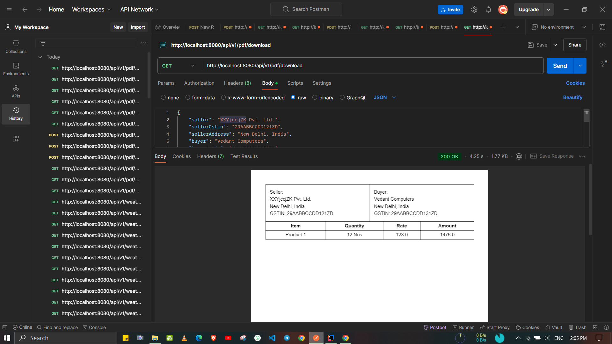
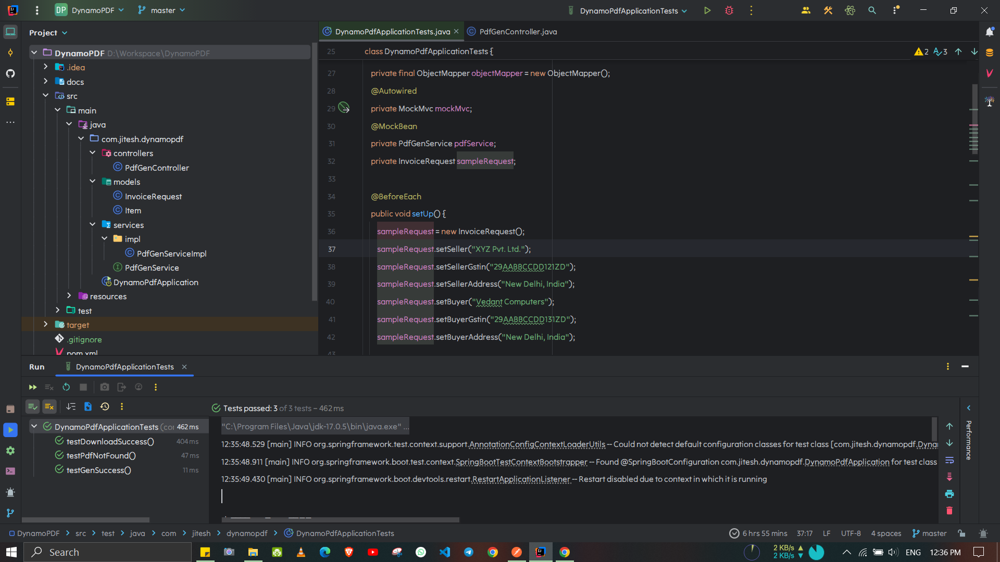
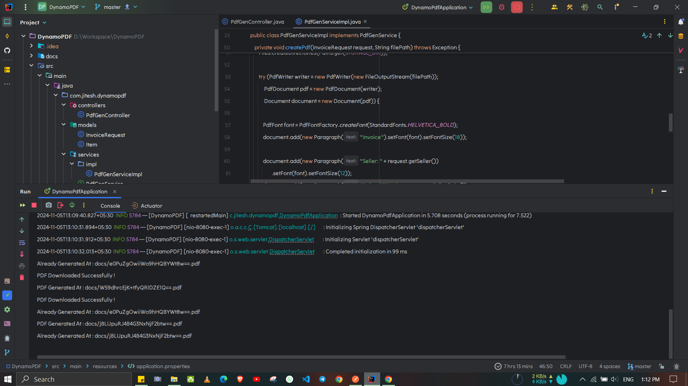

# INVOICE GENERATION APPLICATION

> :: [Hosting](https://dynamo.koyeb.app/)

> EndPoints :

- POST - https://dynamo.koyeb.app/api/v1/pdf/generate
- GET - https://dynamo.koyeb.app/api/v1/pdf/download

> Key Learnings :

- Hash Generation
- Unique File Identification Using Hashing
- Have Familiar With iTEXT7 but explored Flying Saucer first time

> SnapShots :

- With iText7 

- With Flying Saucer

- Unit Testing 

- Debug 